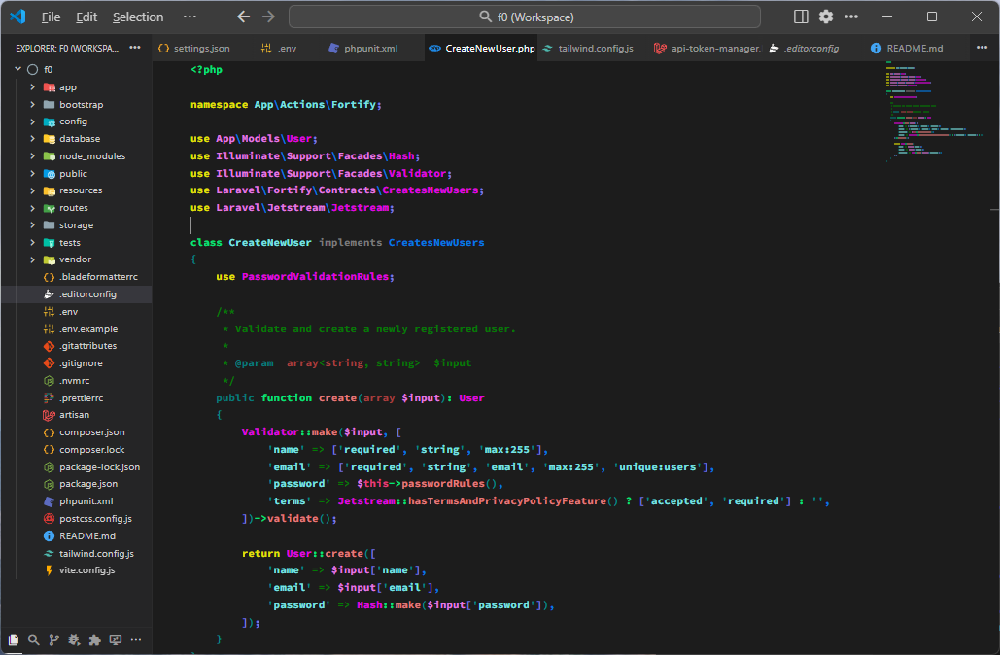
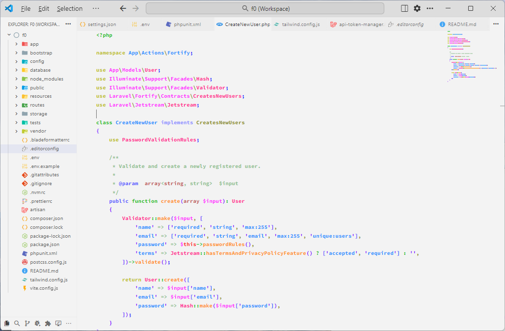

# Infinity 8 Theme for VS Code by Shingo Murata

## Infinity 8 themes feature 8 two-tone syntax highlighters

This theme is a super lightweight version of Infinity 64 simplified to eight colours:

1. Infinity 8 Whiteboard
2. Infinity 8 Blackboard

Thanks to Big Al complex highlighters seem redundant in 2025 inviting this next logical step.

---




---

## Recommended settings for a minimal interface

```JSON
{
	"editor.bracketPairColorization.enabled": false,
	"editor.guides.bracketPairs": false,
	"editor.guides.indentation": false,
	"editor.lineNumbers": "off",
	"editor.minimap.renderCharacters": false,
	"editor.minimap.scale": 1,
	"editor.renderLineHighlight": "none",
	"editor.scrollbar.vertical": "hidden",
	"editor.scrollbar.horizontal": "hidden",
	"window.autoDetectColorScheme": true,
	"window.systemColorTheme": "auto",
	"workbench.preferredDarkColorTheme": "Infinity 8 Blackboard by Shingo Murata",
	"workbench.preferredLightColorTheme": "Infinity 8 Whiteboard by Shingo Murata",
}
```

[](XMR```43shingofqi5gRhYBft6ErCEZEZbZGDLB3AAiw39gnE31Cjq3cKwrVhKRoSoGj5CMQWqhLMtN21rmgXYHSo2dkXG9Aj7gwa```)